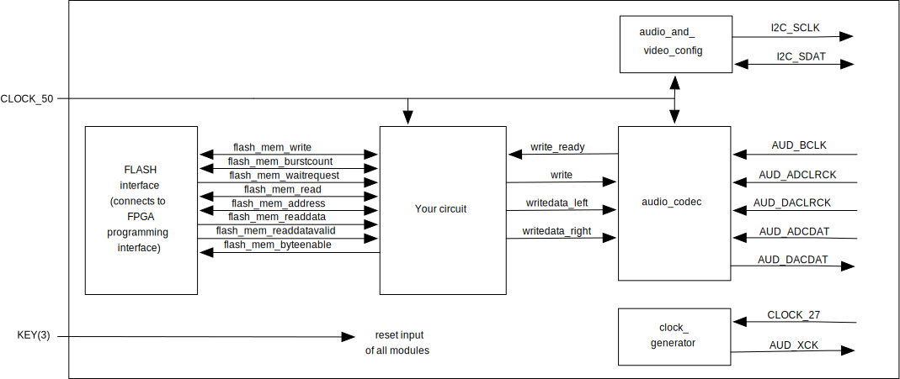
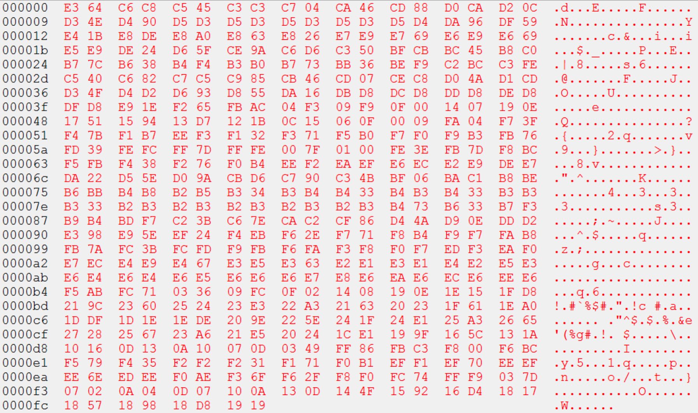
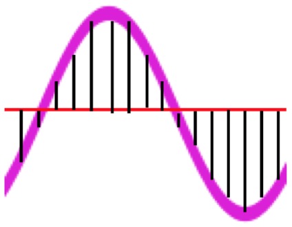
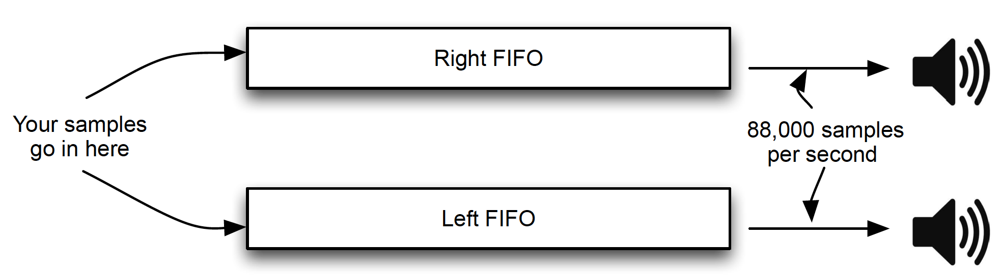

# Lab 4: Can you hear me now?

## Contents

* [Background](#background)
* [Design](#design)
  * [Task 1: Programming the Flash Memory](#task-1-programming-the-flash-memory)
  * [Task 2: Build a Flash Memory Reader](#task-2-build-a-flash-memory-reader)
    * [The flash controller interface](#the-flash-controller-interface)
    * [Building your state machine](#building-your-state-machine)
    * [Testing your Flash reader in simulation](#testing-your-flash-reader-in-simulation)
    * [Testing your Flash reader on the FPGA](#testing-your-flash-reader-on-the-fpga)
  * [Task 3: Sound in the digital domain](#task-3-sound-in-the-digital-domain)
  * [Task 4: Understanding the CODEC and running the test program](#task-4-understanding-the-codec-and-running-the-test-program)
  * [Task 5: Playing the audio samples](#task-5-playing-the-audio-samples)
  * [Task 6: Alvin and the Chipmunks](#task-6-alvin-and-the-chipmunks)
  * [Task 7 (BONUS): Flanging away](#task-7-bonus-flanging-away)
* [Deliverables and Evaluation](#deliverables-and-evaluation)

## Background

Many digital systems process “streaming data” such as audio or video. Rather than implementing complex processing on a small amount of data, these systems often perform relatively simple processing on a large amount of data. In this lab, you will create a system that reads sound samples from an off-chip flash memory and sends them to your board's audio port. In doing this, you will learn how to read from off-chip memory, deal with audio samples, and interface to an audio core using a handshaking mechanism.

<!--
For those of you that only have a DE0-CV board available: unfortunately, the DE0-CV does not contain an audio jack. In this case, you will need to borrow a DE1-SoC.
-->

The figure below shows the block diagram of the circuit you will build. The block labelled _your circuit_ is what you will design. The _audio_codec_, the _audio_and_video_config_, and the _clock_generator_ blocks will be given to you, as well as the _flash_memory_interface_ block. The interface between your circuit and the audio codec is simple and will be described below. Your circuit will be clocked by the 50MHz clock and will receive an active-low synchronous reset input from KEY[3].

There are two parts in this lab. First, you will build a state machine that reads from the flash memory; you will test this separately. Once that works, you will add the part of the circuit that interfaces with the audio core.

## Design

### Task 1: Programming the Flash Memory

The flash chip on the DE1-SoC is a separate chip on the board (not part of the FPGA). Flash memory chips are non-volatile (i.e., maintain their contents even after they are powered down), but can still be reprogrammed. The first task is to download our test song to the flash memory chip on your board. Since flash memory is non-volatile, you only have to do this once. Once your chip is programmed, it will remain there as you complete the rest of the lab.

1. Launch the Programmer tool in Quartus Prime. 
2. Click _Auto-Detect_. If you get a popup box titled _Select Device_, then choose _5CSEMA5_.
3. If you get a popup asking “Do you want to update the Programmer’s device list, overwriting an existing settings?”, choose _Yes_.
4. Right-click the _5CSEMA5_ device and choose _Edit&rarr;Change File_, and select the `american_hero_song88.jic` file from the `data` folder.
5. A new entry will be added to the programmer list for the device _EPCS128_, which is the flash memory chip. For this entry, check the _Erase_ box and click _Start_. Wait for it to complete.
6. Next, for the same device check the _Program/Configure_ box and click _Start_. The song will now be programmed into the flash memory.

### Task 2: Build a Flash Memory Reader

In this task, you will build a state machine to read samples from the flash memory chip. The sound samples are each 16-bit signed numbers, and there are 0x200000 (i.e., 2097152 in base 10) samples in the flash memory. To aid your development process, in this task you will create a state machine that reads the samples from the flash and stores them in on-chip memory. Then, using the in-system memory content editor, you can verify that your flash memory reader is working correctly.

#### The flash controller interface

You will be interfacing with an Altera flash controller, provided in the `components` folder. It uses the [Avalon memory mapped interface](docs/avalon_spec.pdf).

The Flash controller is described in Section 39 of the [embedded IP user guide](docs/ug_embedded_ip.pdf), under _Altera Generic Quad SPI Controller_. Look at table 39-1, which describes the interface signals. Aside from `clock` and `reset`, there are two sets of signals: one for accessing control and status registers (CSR), and one for memory access of the flash device. You **do not** need to access the CSR registers, so you can ignore these signals. You should read the descriptions about the `avl_mem_*` signals for retrieving data from the flash memory.

#### Building your state machine

You will implement your design inside `flash_reader.sv` and the comprehensive tests in `tb_flash_reader.sv`.

If you look inside `flash_reader.sv`, you will see that it instantiates the flash controller. You can include this in your project by including the file `flash.qxp` from the `components` folder.

You will also need to set the _Programming Mode_ to _Active Serial_ as follows:

- go to _Assignments&rarr;Device_, and click on _Device and Pin Options_;
- select the _Configuration_ tab;
- in the Configuration Scheme drop-down menu, chose _Active Serial x1_;
- hit _OK_ twice to exit the menus.

The state machine you will build will handle the various interface signals to the Flash controller. The inputs to the controller are `flash_mem_write`, `flash_mem_burstcount`, `flash_mem_read`, `flash_mem_address`, `flash_mem_writedata`, and `flash_mem_byteenable`. The outputs are `flash_mem_waitrequest`, `flash_mem_readdata`, and `flash_mem_readdatavalid`.

Since we will only be _reading_ from the flash, you can connect the `flash_mem_write` port to constant 0 and leave `flash_mem_writedata` unconnected. Also, since we will not be using the burst capabilities of the flash controller, you can connect the `flash_mem_burstcount` to constant 1.

The address signal is a 32-bit word index in the memory, and the data signal is 32 bits wide; you will want all bytes in a word, so set all four bits in `flash_mem_byteenable` to 1. Since an audio sample is only 16 bits, there are two audio samples per word in the flash memory. So every time you do a 32 bit read from the flash, you will get two samples. For each word, the first audio sample will be in the lower order 16 bits, and the next audio sample will be in the upper order 16 bits. So, the very first sample is in the lower-half of the flash at address 0, and the very last sample in the song will be in the upper half of the flash at address 0x7FFFF.

Be sure you respect the `flash_mem_waitrequest` and `flash_mem_readdatavalid` signals in your implementation.

#### Testing your Flash reader in simulation

As usual, you will need to have a comprehensive testbench in `tb_flash_reader.sv`.

But what about the Flash module? Unlike in the VGA lab, we are not providing a simulation-only Flash module, which is inconvenient since flash_reader.sv needs to instantiate one. Therefore, to successfully test your flash reader, you will have to write your own simulation-only version, based on the template in `tb_flash_reader.sv` and your understanding of the Altera Generic Quad SPI Controller module from the Embedded IP user guide.

We will not test your simulation-only fake flash module directly, but we will include it when checking your testsuite for coverage. That means you don't need to emulate full functionality of the flash, just enough to enable thorough testing of your flash reader.

**Make sure that your flash reader also works on the FPGA**. If your flash reader works in simulation but not on the FPGA, it may well be that your simulation-only version of the flash module is incorrect. This would be very bad news, as the autograder will use its own flash module (which matches the `.qxp` one) for everything except coverage tests.

#### Testing your Flash reader on the FPGA

Although you will eventually want your flash reader to read all 0x200000 samples, in this task, you will test your reader by reading only **256 samples**, and storing them in an on-chip memory. The on-chip memory will not be part of the final design for this lab, it is just used here so you can test your Task 2 in isolation.

You should use the memory wizard to create an on-chip memory that is **16 bits** wide. Your memory module should be called `s_mem` and the instance should be named `samples` (as in `flash_reader.sv`); its instance ID used in the memory content editor should be `S` (uppercase). You will store the **first 256 samples** in this memory, and use the memory content editor to examine them. The result should be as follows:

 
Note: in the output above, the tool has displayed each 16 quantity as two 8-bit quantities in big-endian order (MSB followed by LSB). So, the first sample is 0xE364, the second sample is 0xC6C8, etc. If the first word appears to be 0xFFFF, you need to push the reset button.

**Common error #1:** if each pair of samples are swapped (i.e., the first sample is C6C8 and the second sample is E364, etc), it is possible that you forgot that each 32-bit word in the flash corresponds to two samples: the sample in the lower order 16 bits comes first, followed by the sample in the upper order 16 bits.

**Common error #2:** if the numbers don’t look anything like this, it is possible that you read more than 256 samples. In that case, later samples would overwrite earlier ones in the on-chip memory, so you could be seeing a later part of the song. Make sure you are stopping at 256 samples in this task.

**Do not go on until you are sure this works both in simulation and on the FPGA.**

### Task 3: Sound in the digital domain 

Before continuing, you need to understand how sound is represented in the digital domain. In the real world, a sound can be modelled as a continuous wave. This wave may be a simple sine wave (which is a pure tone) or a more complex wave (which is actually can be represented as a sum of sine waves).

In the digital domain, this continuous wave is converted into discrete audio samples using a regular sample rate. The collection of samples represents an approximation of the original waveform, and hence an approximation of the original sound. 
The amplitude of the continuous wave is an analog value even at these discrete sample points; the analog amplitude is quantized into a 16-bit digital value; any error here is roughly 1 part in 65,000, which is barely perceptable.
The rate at which the wave is sampled (the “sampling rate”) determines the fidelity of the sampled sound frequency range relative to the original continuous waveform. Typical sampling rates are in order of 20KHz–80KHz; this results in sufficient samples to reconstruct the original waveform “well enough”. We will assume an 88,000 Hz sampling rate — more than enough to make the most dedicated audiophile happy.

The figure below shows the sampling of a single tone (a single sine wave). The samples are a collection of values, some negative and some positive that can be combined to “look like” the original waveform (in this case, a sine wave). Note that the frequency of the samples is much higher than the frequency of the sine wave. 

 
Clearly, the sampling rate, the number of samples, and the length of the recording all related. In this lab, our song has 2097152 samples, which is less than a minute at our sampling rate. The amplitude of the overall waveform determines the volume. If you multiply all sample values in a song by a constant factor, the overall volume will change.

Remember that any complex waveform can be represented as a sum of sine waves. If the frequencies of these sine waves are altered, the tone will change. This means, for example, if you take a song that was sampled at a certain rate and play it back at a lower sampling rate, the wavelength of each constituent sine wave be _longer_ in the reconstructed signal. This will result in a _lower_ tone (in fact, for pure tones, halving the playback rate lowers the tone by exactly one octave).

There are no deliverables for this task.

### Task 4: Understanding the CODEC and running the test program

We are supplying you with a pre-designed audio CODEC (coder-decoder). This circuit was designed and distributed by Intel/Altera. The CODEC actually consists of three blocks, and you will include all three blocks in your Verilog code (as shown in `sound.sv`).

The operation of the CODEC is shown below. Your circuit will insert samples into the head of two 128-entry first-in first-out (FIFO) queues, one dedicated to the right audio output and one dedicated to the left audio output. Your circuit can insert samples into the FIFO as long as there is space (details on this timing is below). Every 1/88000th of a second, the CODEC will remove the top element in each FIFO and send it to the two speakers. The purpose of the FIFOs is to “balance out” bursty activity in your circuit. Without the FIFOs, your circuit would have to produce new samples exactly once per 1/88000’th of a second which may make timing in your circuit tricky. With the FIFOs, as long as the average rate of queue entry is the same as the average rate of queue exit (88000 samples per second), the system will correctly play notes. Note that the FIFOs are part of the CODEC core; you do not implement these FIFOs in your own circuit.

 
To insert samples into the two FIFOs, your circuit should monitor the `write_ready` signal (which is an output of the CODEC). When this signal goes high, it means there is space in each FIFO for a sample. When your circuit sees it go high, it can drive the `writedata_left` and `writedata_right` buses with the two samples (one for the left speaker and one for the right speaker) and assert the `write` line (these are all inputs to the CODEC). You should then wait for `write_ready` to go low (this may take one or more cycles before it happens), and when it does, you can lower `write`, and start again. This handshaking scheme is important, and your circuit will have to implement it properly, or you will not hear any sound.

The `writedata_left` and `writedata_right` buses are each 16 bits wide in our CODEC (it can be configured differently, but you will not change that). The smallest sample value is –215 and the largest sample value is 215–1. Therefore, if you want to make a maximum-amplitude square wave of 242 Hz, you would insert 182 samples of value –215 followed by 182 samples of value 215–1 (assuming 88,000 Hz sampling rate). Note that you can choose a smaller amplitude square-wave; the amplitude determines the volume of the sound. For us 210 was plenty loud.

Note that the CODEC we are supplying also has the ability to operate in the other direction: taking samples from a microphone and supplying them to your circuit. You won’t be using that feature in this lab. To turn this feature off, you should keep `read_s` at 0, and ignore outputs `read_ready`, `readdata_left` and `readdata_right`.

To understand the CODEC, we have provided a sample Verilog file that plays a single tone on the CODEC. It plays 91 samples of value –215 followed by 91 samples of value 215-1 (and then repeats). This is the sound for a single tone.

Create a new project using the provided Verilog files. You will notice that the audio core consists of a number of Verilog files: all of these need to be added to your project. The state machine that sends samples to the core is in `sound.sv`; you should add this to your project too. Import the pin assignments, compile, and download. To test the circuit, you will need earphones or speakers plugged into the line-out port of your Altera board (to avoid annoying others, please do not use speakers while debugging in the lab). Make sure you can hear a constant tone from earphones plugged into the earphone port of your DE1-SoC.

Examine `sound.sv` carefully and make sure you understand how it works. Pay particular attention to the handshaking interface to the sound core, as you will have to implement something similar in the next task. Do not worry about the code that makes up the audio core itself (the `*.v` files); you don’t need to know what is inside those files for this lab.

There are no deliverables for this task, but **be sure you do it** — otherwise, it will make the next task significantly more difficult.

### Task 5: Playing the audio samples

In this task, you will assemble all the pieces from the previous tasks. You will design a circuit that reads samples from the flash (as in Task 2) and sends them to the audio core (as in Task 4). Remember that, unlike Task 2, here you want to read **all 0x200000 samples** (not just the first 256). Your design should operate in a continuous loop; after sending the last sample, you should start again with the first.

The audio stream we have given you is **mono** (not stereo). You therefore need to send each sample to **both** the left and right speaker. A common error is that if the right and left FIFOs get out of sync (one has more elements than the other) then the `write_ready` signal does not operate as expected. This Should Not Happen&trade; given the problem statement, but if for some reason you have a bug where the FIFOs do get out of sync, then resetting isn't enough to empty the FIFOs. Power cycling the board and reprogramming the FPGA is necessary.

You will place your design in `task5/music.sv` and the comprehensive testbench in `task5/tb_music.sv`. As in task 2, you may have to build additional simulation-only modules to help you test your design; make sure you have a copy of each file in the folder in which it is used.

You will likely find that if you send samples directly to the audio core, it will be _really loud_. You will therefore **divide each sample by 64** before sending it to the CODEC. **Remember** that the samples are all **signed**, so be careful.

A common error will be to hear significant noise (perhaps as loud as the song). If you get this, it is possible that you are not remembering that the samples are **signed**. If you are manipulating signed numbers as unsigned numbers, then the negative samples may be incorrect, leading to an awful-sounding song. Think about how sign extension needs to work when bit widths do not match.

### Task 6: Alvin and the Chipmunks

As described in Task 3, if the sampling rate and the playback rate is not the same, the song will either be played too fast or two slow. In this task, you will modify your circuit so that you can play back the song in one of three modes (use two slider switches to select the mode):

- SW[1:0] == 'b00 or 'b11: Normal mode: as in Task 5
- SW[1:0] == 'b01: “Alvin and the Chipmunks” mode: play back faster than the sampling rate (twice as fast)
- SW[1:0] == 'b10 “Laid back” mode: play back slower than the sampling rate (half the speed)

You need to be able to change modes _as the circuit is running_ (so, for example, as it is playing back, you can switch to “Alvin and the Chipmunks” mode by changing a switch). This means you can’t just modify the input files, since the flash memory is not big enough to store three versions of the song.

The resulting design will be in `task6/chipmunks.sv`, with its comprehensive testbench in `task6/tb_chipmunks.sv`.

At first glance, it may seem that the best way to do this is to change the playback rate. However, this would mean going into the audio core and making extensive changes, which would be very difficult. Instead, it is much easier to do this by modifying only your code. If you think about this, you should be able to come up with a fairly straightforward way to do it.

### Task 7 (BONUS): Flanging away

In this mode you implement a sound filter known as [flanging](https://en.wikipedia.org/wiki/Flanging). This effect consists of adding the original signal to a delayed copy of itself, while varying the delay.

Your implementation should add the original signal with a delayed copy at 80% amplitude. The resulting sum should not be louder than the original song, so remember to renormalize properly, and be careful not to overflow the amplitude (which would result in clipping).

Your delay should vary between 12.5ms and 50ms, as a cosine wave with a period of 0.5s. This means the first sample will be fed back delayed 50ms, and the sample at 0.25s will be delayed 12.5ms.

Your bonus design will be in `task7/flanger.sv`. This is independent of task 6, so your design should work regardless of how the switches are set. The comprehensive testbench goes in `task7/tb_flanger.sv`.

## Deliverables and Evaluation

### Automatic testing

We will be marking your code via an automatic testing infrastructure. Your autograder marks will depend on the fraction of the testcases your code passed (i.e., which features work as specified), and how many cases your testbenches cover.

It is essential that you understand how this works so that you submit the correct files — if our testsuite is unable to compile and test your code, you will not receive marks.

The testsuite evaluates each task separately. For each design task folder (e.g., `task5`), it collects all Verilog files (`*.sv`) in this folder that do not begin with `tb_` and compiles them **all together**. Separately, each required `tb_*.sv` file is compiled with the relevant `*.sv` design files. This means that

1. You must not **rename any files** we have provided.
1. You must not **add** any files that contain unused Verilog code; this may cause compilation to fail.
2. Your testbench files must begin with `tb_` and **correspond to design file names** (e.g., `tb_foo.sv` for design `foo.sv`).
3. You must not have **multiple copies of the same module** in separate committed source files in the same task folder. This will cause the compiler to fail because of duplicate module definitions.
4. Your modules must not **rely on files from another folder**. In particular, this means that any memory images you read in your testbenches must be present in the same folder. The autograder will only look in one folder. For this lab is that you may rely on modules we provided in `components/` for your _design_, but you must provide your own simulation-only implementations of these modules for your _testsuite_.

The autograder will instantiate and test each module exactly the way it is defined in the provided skeleton files. This means that
1. You must not **alter the module declarations, port lists, etc.**, in the provided skeleton files.
2. You must not **rename any modules, ports, or signals** in the provided skeleton files.
3. You must not **alter the width or polarity of any signal** in the skeleton files (e.g., everything depending on the clock is posedge-triggered, and `rst_n` must remain active-low).

If your code does not compile and simulate under these conditions (e.g., because of syntax errors, misconnected ports, or missing files), you will receive **0 marks**. If your code does not match the three synthesizable patterns we discussed in lecture or does not synthesize using Quartus, your marks will be reduced.

### Marks

The evaluation of your submission consists of two parts:
- the TA demo, worth 70%, and
- the autograder tests of your code and testbenches, worth 30%

### Tasks 1, 3, and 4

No deliverables.

### Task 2 [3 marks]

- Completed `flash_reader.sv`
- Completed `tb_flash_reader.sv`
- Any other files you added to the design or testbench

### Task 5 [4 marks]

- Completed `music.sv`
- Completed `tb_music.sv`
- Any other files you added to the design or testbench

### Task 6 [2 marks]

- Completed `chipmunks.sv`
- Completed `tb_chipmunks.sv`
- Any other files you added to the design or testbench

### Task 7 [BONUS]

- Completed `flanger.sv`
- Completed `tb_flanger.sv`
- Any other files you added to the design or testbench
