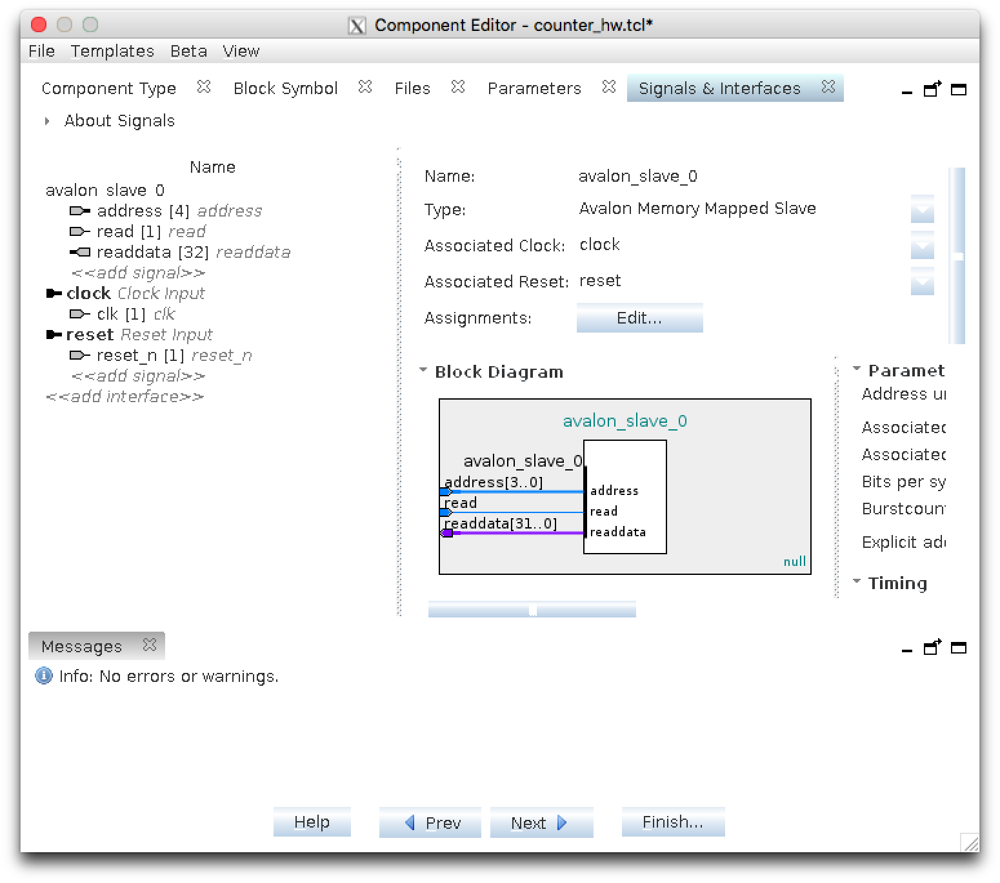
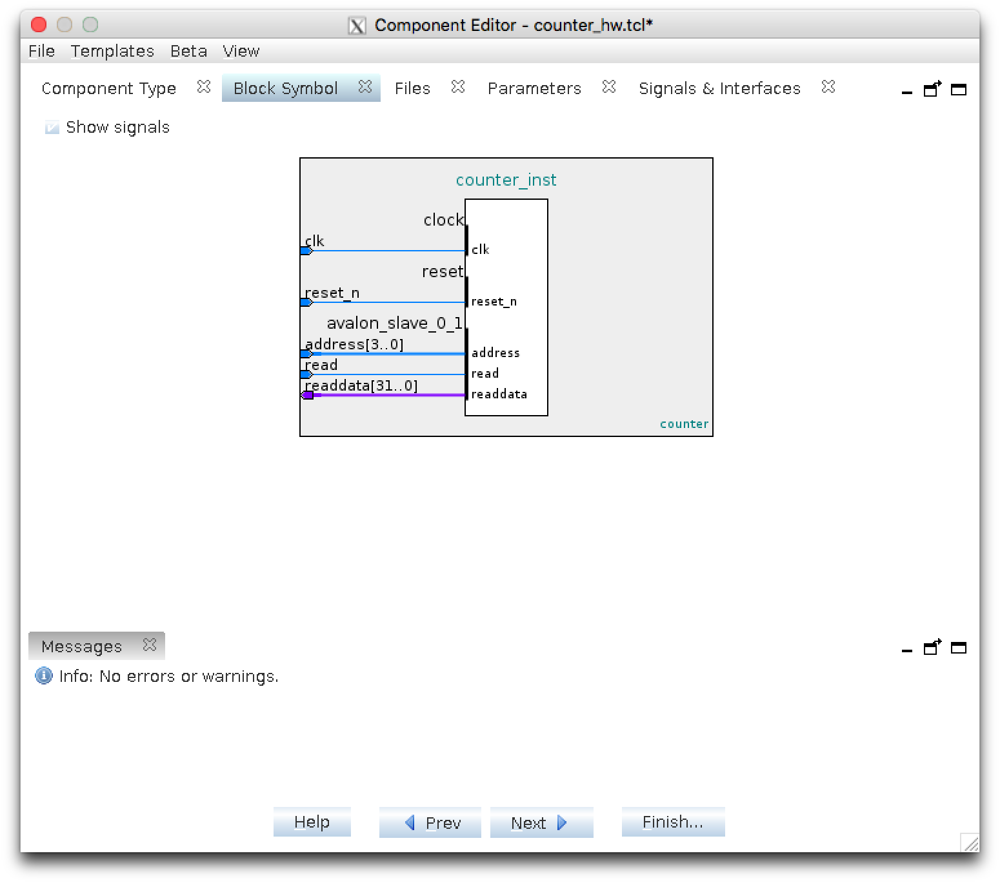

# Lab 5: Who put a system on my chip?

## Reflections

*This lab is by far the most challenging and yet the most interesting one (making sense as the final lab of the course). I built an entire system-on-chip on the FPGA, including a Nios II embedded processor (a soft CPU achieved by the programmable logic blocks inside the FPGA), an on-chip RAM, and several other custom IP cores optimized for specific functionalities. Different components (IPs) in the system are coordinated by a memory-mapped interface called Avalon, and each of them was assigned a system-wide base address such that data can be transferred between them correctly. Custom IPs were synthesized from Verilog codes describing their behaviour and I/O, the exact circuits were hidden behind block diagrams showing only the I/O on the interface, such as `reset_n`, `clock`, `read/write`, and `readdata/writedata`. I integrated these IPs into the system by making the correct connections with other components, and assigning unique base addresses, through a GUI rather than in Verilog. What is more, the CPU and the memory IPs have been provided by the program and the developer would only need some clicking around instead of writing the Verilog codes himself. A far more efficient, system level design approach, for the given complex digital hardware system. The developer then provided software written in C codes that would have been complied and loaded into the on-chip RAM, the CPU then fetched those instructions and executed them, sending and receiving data bus to or from different components in the system, marked by their base addresses.*

## Contents

* [Background](#background)
  * [Q16.16 fixed point](#q16.16-fixed-point)
  * [Debugging advice](#debugging-advice)
* [Design](#design)
  * [Task 1: Tutorials](#task-1-tutorials-and-simulating-the-nios-ii-system)
  * [Task 2: Measuring performance](#task-2-measuring-performance)
  * [Task 3: Custom instructions](#task-3-custom-instructions)
  * [Task 4: Wrapping the VGA core](#task-4-wrapping-the-vga-core)
  * [Task 5: 2D transforms in software](#task-5-2d-transforms-in-software)
  * [Task 6: A 2D transform accelerator](#task-6-a-2d-transform-accelerator)
<!--  * [Task 7 (BONUS): Matrix inverse](#task-7-bonus-matrix-inverse) -->
  * [Memory map](#memory-map)
  * [Common problems](#common-problems)
* [Deliverables](#deliverables-and-evaluation)


## Background

In this lab, the Verilog designs you will write are simple and fairly straightforward. The challenge comes from the system-on-chip component: you will build an entire system with an embedded softcore CPU, write modules that obey its interconnect interface specification, and write C code that interacts with the hardware modules you added. Because the system as a whole is more complex than the systems we've built before, it will be _extra_ important to carefully debug all the pieces of your design before you connect them together.


### <a name="q16.16-fixed-point"></a>Q16.16 fixed point

In this lab, we will be using **signed** fixed-point fractional numbers. The complete number takes 32 bits: bit [31] represents the sign bit, bits [30:16] represent the integral part, and bits [15:0] are the fractional part — all in two's complement. You can think of it as having integers but agreeing that the values we see really stand for themselves divided by 65,536. This format is commonly referred to as the [Q format](https://en.wikipedia.org/wiki/Q_(number_format)); specifically, we will use Q16.16.

Computations on Q16.16 are performed by doing the actual operation on the 32b quanitity as if the numbers were integers, and then adjusting the fractional point in the result as required. Because the fractional point in Q16.16 is fixed, the only way to move the fractional point is to shift the result as necessary to restore the result into Q16.16 format. To gain some intuition into this, try this out with some base-10 numbers: for example, try operations like addition, multiplication, and division between numbers like 1234, 123.4, 12.34, and so on, and find out where the decimal point goes.

For the purposes of this lab, conversion from Q16.16 to an integer can be done by **truncating** the fractional bits (no need to round).


### Debugging advice

- We seriously suggest that you **extensively** test the Avalon cores **inside Modelsim**. If you don't, it can be tricky to find problems in a moderately complex system that is your SoC when you have very little visibility into the FPGA. You don't want to spend hours trying to figure out why there is nothing on your screen if it turns out that your pixel transformer sends all the pixels off screen.

- You will also notice that we have provided read interface signals even for those cores that are write-only. You may find it convenient to use these for debugging your cores, for example by connecting them to the Nios II data master and running simple programs to interrogate your module.

- If you find yourself updating an IP module, remove the source files and re-add them, and make sure you regenerate the system. For simulation, recompile all the files and restart the simulation; for FPGA testing, resynthesize everything, and download the new image to the FPGA. Spending six hours only to discover that you keep using an old version of some file is not fun.


## Design

### Task 1: Tutorials and simulating the Nios II system

*A tutorial task, getting to know how to make SoC and custom IPs. One thing to notice is that the generated system’s RTL can still be simulated by ModelSim just like any other RTLs. This is a crucial step. It is extremely important to have a clue about what is going on behind the black box. It is therefore a handy tool when debugging the hardware. Notice bugs can also occur in the software, which is somewhat easier to troubleshoot.*

#### Tutorials

Complete the following tutorials:

- [Platform Designer tutorial](docs/qsys_tutorial.pdf)
- [Making Platform Designer Components tutorial](docs/making_qsys_components.pdf)

These tutorials describe how to build a Nios II-based SoC system and how to build components that hang off the Avalon on-chip interconnect; you will need these in the rest of the lab. Save your system as `pixel_xform_system` and generate the simulation HDL files.

Also read through the following guides:

- [Custom Instructions Guide](docs/nios2_custom_instructions_guide.pdf), sections 1, 2, 3, and 4
- [Avalon Interface Specification](docs/avalon_spec.pdf), sections 1 and 3

Note that the Avalon memory-mapped spec includes many signals, but you generally only need to connect the subset you are using. For example, a write-only slave will need to have `clock`, `reset_n`, `address`, `write`, and `writedata`, and has no need for the other wires in the interface spec. In general, the modules we provided to get you started provide the set of wires you actually need to connect.

You will want to use **32KB of memory** (32,768 bytes) instead of the 8KB specified in the tutorial (it's possible to do the lab in 8KB RAM, this is just to make your life easier). You will also need to adjust the address ranges mapped to your Avalon modules as per the table in the [Memory Map](#memory-map) section. Be sure this memory is named `onchip_memory2_0` in the Platform Designer; this name will be important later.

You might also want to read the [Common Problems](#common-problems) section for solutions to some Platform Designer, hmm, “infelicities,” in case you run into them.


#### Simulating the generated system in Modelsim

To simulate the system in Modelsim, you will need to add the following files to your Modelsim project:

- `pixel_xform_system/simulation/submodules/*.v`
- `pixel_xform_system/simulation/submodules/*.sv`
- `pixel_xform_system/simulation/pixel_xform_system.v`

(if these names don't exist, you forgot to save your system as `pixel_xform_system` as specified above).

You will also need to copy these files into the directory where you are simulating:

- `pixel_xform_system/simulation/submodules/*.hex`

These are memory image files for all the CPU internal memories (e.g., register file) as well as the 32KB main memory you created.

For simulation, you will also want to tell Modelsim to use the `altera_mf_ver` library, just as you did for Quartus-generated memories in the ARC4 lab.

When you simulate your design, you may see a large number of warnings. Some of them are due to the Platform Designer being sloppy:

- Some warnings in `pixel_xform_system.v` about missing connections for some JTAG ports. We will not be using these in simulation so we don't need to worry about it.
- Lots of warnings in `pixel_xform_system_nios2_gen2_cpu.v` about missing memory block connections, such as `wren_b`, `rden_a`, etc. This is because the generated Nios II CPU uses embedded memories for things like the register file, and does not connect some of the ports. (It works fine because the instantiation parameters configure the memory so that these ports are not used inside, but Modelsim does not know about that.) You may ignore those warnings.
- A few warnings about `DONTCARE` and Stratix devices. Ours is a Cyclone V FPGA, so we couldn't care less.

Be sure to go through the warnings and make sure that none of them refer to **your** modules. It's easy to miss important issues in the sea of spurious warnings raised by the generated system and spend hours upon hours debugging.

In the `task1` folder, you will find `tb_pixel_xform_system.sv`, a top-level testbench for the entire Nios II system. Simulate this together with your switches/LEDs Nios II system from the tutorial, and examine the waveforms (you can add all signals by typing `add wave -recursive /*` in the Modelsim Tcl command prompt).

You will find that not very much interesting is happening. Look at the signals `nios2_gen2_0_instruction_master_address`, `nios2_gen2_0_instruction_master_readdata`, and `nios2_gen2_0instruction_master_read` — these connect to the on-chip Avalon interconnect to read instructions from the on-chip memory. You will see that read requests are continuously being sent for address 0, and valid data (also 0s) are being returned. This is because the initial value of the on-chip memory is 0x00000000, which encodes the instruction `call 0` — so the CPU starts executing at address 0, reads an instruction that tells it to go back to address 0, and continues in an infinite loop.

To make life a little more interesting, replace the contents of `pixel_xform_system_onchip_memory2_0.hex` with the contents of `set_leds.hex` and restart your simulation. This image contains a very short program at address 0 (where you placed the CPU reset vector):

```assembly
main:
    movui r2, 0xaa
    movui r3, 0xa040
    stw r2, 0(r3)
loop:
    beq zero, zero, loop
```

This tells the CPU to write 0xaa to the memory address 0xa040 — where your LED module is mapped. If you did the Platform Designer tutorial correctly and followed the [Memory Map](#memory-map), you should see the `leds` bus in the waveforms change to `10101010` about 32 clock cycles after the CPU was reset.

Look again at the signals `nios2_gen2_0_instruction_master_address`, `nios2_gen2_0_instruction_master_readdata`, and `nios2_gen2_0_instruction_master_read`. You should find that the CPU reads addresses 0, 4, 8, and 12, and continues to read from address 12 from then on, since our `beq` instruction makes an infinite loop. You can also observe the `*_data_master_*` signals, and see the moment where 0xaa is written to address 0xa040 to be sent to your LEDs module. This is also a good opportunity to confirm your understanding of how the Avalon master-slave interface works, including our good friend `waitrequest`.

The deliverables for this task are your entire autogenerated system, i.e., the `.qsys` and `.sopcinfo` files and the entire contents of the `pixel_xform_system` folder. To receive any credit, however, you must demonstrate to the TA the simulation waveforms showing the program running in the CPU and setting the LEDs.


### Task 2: Measuring performance

*The most challenging one, took me more than a week to finally get it working. A custom IP that counted the number of clock cycles passed since reset. The Verilog code seemed easy and simple, however, I failed to realise that although the counter component worked perfectly when simulating in isolate, it is likely to misbehave when integrated into the entire system as there was no obvious way to mimic the signal coordination of the Avalon interface. The Verilog code was initially written with an erroneous understanding of Avalon’s behaviour. I also wrote my first program in C language, from which I learned a great deal about the language. For instance, pointers, data types, functions, bit-wise shift, and for loops. C language can directly interact with the data in hardware in terms of memory addresses stored by pointers. When defining a variable in C, one should consider its data width and data type, as they need to be consistent with the actual data bus in the hardware. What the software did was to perform the multiplication operation 1000 times, and measure the average number of cycles needed for one multiplication. Since there was no specialized IPs to perform the multiplication, the operation was achieved by the CPU with logic blocks capable of performing any kinds of operation. But because of such universality, the process was expected to be relatively slow.*

In this task you will add (to the SoC design you created in Task 1) a custom Avalon memory-mapped slave that **continuously** counts the clock cycles since the system was reset. You will also write corresponding software to sample and test the counter.

The counter will be a 64-bit-wide unsigned integer. Because we will use a 32-bit Avalon interconnect, we will have to split reading the value into two parts: reading address offset 0 will return bits 31..0 and reading address offset 1 will return bits 63..32. A skeleton is provided in `counter.sv`.

The `counter.sv` skeleton has all the ports required to **directly** implement the Avalon interface, and should be the top-level module for the new IP core you add to your system. You are not going to wrap it in another module like you did with the register in the tutorial.

There are two differences between the tutorial Avalon interface and the `counter.sv` interface. Firstly, the counter has an incoming `address` bus that did not exist in the tutorial, and has no byte-enable signal. Secondly, the counter only implements the minimum required to have a read-only Avalon interface — this is because you never need to write to it.

Once you have implemented the counter, add it as an IP component. It should have an Avalon Slave interface, a Clock interface, and a Reset interface, as shown below:

<p align="center"></p>

The block symbol tab should correspond to the ports in `counter.sv`:

<p align="center"></p>

Write a comprehensive testbench in `tb_counter.sv`. This testbench should test `counter` **in isolation**, and must instantiate only `counter` — without the rest of the the Nios II system. (This is probably the easiest testbench you've had to write so far!)

Next, complete the file `hw_counter.c` that returns the 64-bit value of the counter. This means that you will have to read both 32-bit words from your counter module and combine them.

To do this successfully, you will need to think about how addressing works from the perspective of the processor. The processor addresses memory (and the Avalon interconnect) at **byte** granularity, but your counter operates is at **32-bit word** granularity. This means that if the counter core's address bus is 4 bits, its address space is 16 **words**: the first word will be at address 0, the second at address 1, and so on, **from the perspective of the counter core**. But from the processor's perspective, the same 16 words will be treated as 64 bytes — so if you place this core at base address 0xa100, the entire address space from the perspective of the CPU will span 0xa100–0xa13f.

Note that, because reads from the Avalon interconnect do not happen instantly, an interesting corner case arises in reading the counters. Suppose the counter value is 0x00000001ffffffff; in this case, the counter high word will be 1 and the low word will be 0xffffffff. But between your reading one of these words and the other, some cycles will have elapsed and the counter will have changed (say to 0x0000000200000008)! Now, if you read the low word first and the high word second, you will end up with 0x00000002ffffffff, which is way too high; if you read the words in the other order, you will get 0x0000000100000008, which is way too low. To receive full marks, your `hw_counter()` function must handle this corner case correctly in the `hw_counter()` source code — that is, you may not alter the `counter.sv` definition so that it ever stops. Hint: you can rely on the fact that it will take much less than 2<sup>32</sup> cycles to read the counter via the Avalon interface several times in quick succession.

Your `hw_counter.c` file must include only the implementation of `hw_counter()` and any relevant constants. It must be self-contained: that is, it should not include `main()` or refer to library functions via `#include` directives and the like.

Now, use your `hw_counter()` function to determine the number of cycles taken by **one thousand** 32-bit integer multiplications. Use the following function, and add your timing start and end code. Be sure that you **enable optimization level -O2** when compiling your code, or else your measurement will not be correct.

```C

#include "hw_counter.c"

int __attribute__((noinline)) measure(int min_i, int max_i) {
    register int i, j;
    j = 0;
    /* begin timing */
    for (i = min_i; i < max_i; ++i) {
      j += i * i;
    }
    /* end timing */
    return j;
}
```

Call this function from your `main()` as `measure(1000, 2000)` and single-step through the program that the multiplications are actually taking place by looking at the actual CPU instructions in the disassembly tab. There is no convenient `printf()` you can use, so you will need to figure out the registers that correspond to various variables, and read the values directly from those registers. You will want to set a breakpoint after your measurement has been taken, rather than single-step through the whole 1,000 multiplications.

Report the **average** number of cycles taken **for a single 32-bit integer multiply** by replacing the 0 in the appropriate entry in `reports/cycles.csv` with your measurement. Because our Nios II/e emulates multiplication in software, you should find that multiplications are quite slow.


### Task 3: Custom instructions

*A fairly easy task, instead of doing multiplication in software that used the all-purpose logic blocks inside the CPU, I simply modified the Nios II processor, adding an extra custom logic block inside the CPU (called custom instructions) to handle a specific task, in this case, multiplication. Because this logic block was designed for a sole duty, it was about 10 times faster compared to the general software method.*

In this Task, you will implement a custom instruction, integrate it in the Nios II processor core, and measure the performance impact.

You will implement a `mult` instruction which multiplies two 32-bit _signed_ integers. This will be custom instruction opcode 0.

Implement the hardware in `mult.sv`, and the testbench in `tb_mult.sv`. Again, your testbench must only test the `mult` module and must not include the Nios II system. (This is an even easier testbench.)

Then, implement a function to test it in `hw_mult.c`: this function accepts two 32-bit signed integers and should return their product **using your custom instruction**. You will either want to use the `__builtin_custom_inii` compiler intrinsic in C or the `custom` instruction in assembly.

Measure the performance of `mult` on 1000 multiplications using the same code you used in Task 2. As before, replace the appropriate entry in `reports/cycles.csv` with the average number of cycles **per multiplication**.


### Task 4: Wrapping the VGA core

*Straightforward. A VGA IP was built to receive pixel coordinates and colour from the CPU (which in turn receives data from the software) and export the VGA signals to the FPGA board. The C program provided the pixel coordinates and the colour.*

Your objective here is to wrap the VGA core as an Avalon memory mapped interface slave, and integrate it in your Nios II system. A template Verilog file is provided in `vga_avalon.sv`.

The module you are to write will follow a very simple write-only interface. Whenever address offset 0 is written and the coordinates are within screen boundaries, you should send **exactly one pixel plot event** to the VGA core. (If the coordinates are outside of the screen, the write should be ignored.)

The write request consists of a single 32-bit word with address offset 0, with the following bit encoding:

| word | bits   | meaning      |
| ---- | ------ | ------------ |
|   0  | 18..16 | colour       |
|   0  | 15..8  | x coordinate |
|   0  | 6..0   | y coordinate |

As usual, the top-left corner corresponds to coordinates (0,0). Your module should ignore read requests as well as writes to locations other than offset 0. 

When you add your VGA component to the IP catalogue, you will want to use a conduit interface and export the VGA wires. Your toplevel will then connect them to the VGA signals as usual.

The testbench goes in `tb_vga_avalon.sv` as usual. Again, it will not include the entire Nios II system, but rather interact with your module directly. We will also not include the VGA modules when checking your testbench for coverage, so you will have to mock the VGA core in `tb_vga_avalon.sv` or another `tb_*.sv` file.

Next, complete `vga_plot.c`, which provides a C interface to your VGA module. As before, it should implement only `vga_plot()`, should not include any libraries, and should not implement any other functions such as `main()`.

In the `misc` folder you will find a file called `pixels.txt`, which has (_x_,_y_) pixel coordinates for an image. These pixels should be drawn in white by repeatedly calling `vga_plot()`. (Note that `vga_plot()` and your `vga_avalon` module must support all colours, though.)

To demo this task, you will have to load your Nios II system on your board, and then load C code that produces this image. There are nearly 2,000 pixels, so if you are not somewhat careful you might run out of memory: make sure you encode the pixel coordinates as bytes (`unsigned char`) rather than full integers.


### Task 5: 2D transforms in software

*Purely software. I wrote a C program that applied a transformation matrix to the pixel coordinates such that the figure would rotate 45 degrees clockwise around the centre of the screen (80, 60). Note that the custom instruction of multiplication was used to speed up the process to some extent. However, other processes were still performed by the general CPU ALU (arithmetic logic unit), such as the calculation of new coordinates. Hence, the plotting process was relatively slow.*

In this task, you will learn how to scale, rotate, and translate pixels via matrix-vector multiplication. We will do this for 2D points, but it works the same way for 3D points, and it's how you can move your viewpoint in a 3D video game.

To transform 2D (_x_,_y_) points, we will first project them to 3D in the _z_=1 plane (by adding a _z_ coordinate of 1), transform them using a 3×3 matrix, and project them back to 2D space (by dropping the _z_ coordinate). We need to do this because some affine transformations — specifically translation — cannot be represented by a 2D matrix (think about how you could translate the origin). You might find the [affine transformations examples on Wikipedia](https://en.wikipedia.org/wiki/Transformation_matrix#Affine_transformations) useful for testing.

Complete the function `pixel_xform()` in `pixel_xform.c`. It takes pixel coordinates (unsigned integers) and the elements of the transformation matrix _M_ in signed Q16.16 (represented here by signed ints). Make sure you use your custom `mult` instruction rather than the software emulation. You might find that you don't need to use all of the matrix entries. As before, it should implement only `pixel_xform()`, should not include any libraries, and should not implement any other functions such as `main()`.

Using your cycle counter, measure how long it takes to transform the image from the previous part by a matrix that rotates your image **45° to the right about the centre of the screen**, i.e., coordinates (80,60). Because the standard rotation matrix rotates about the origin, your transformation will first have to translate your pixels, then rotate them, and finally translate them back, all in one matrix. Also, note the direction of rotation: recall that on your screen the origin is at the top-left, not at the bottom-left. Record your measurement in `reports/cycles.csv`.

To demo this part, you will need to display the image transformed with any matrix the TA will provide.


### Task 6: A 2D transform accelerator

*A custom accelerator of the transformation-plotting process was made. This time, the C program needed only to provide the transformation matrix and the original coordinates, rather than calculating the new coordinates using the original ones and the matrix. The IP would receive the matrix and store them in registers, then it would receive original coordinates and compute the transformed using hardware. It then sent the correct coordinates and the colour, directly to the VGA IP through the Avalon interface, rather than feeding back to the CPU, who in turn streams the data to VGA. The process was hence made faster. Notice this IP has two interfaces, one faced the CPU, whom it received the data and was therefore, a write-only slave. The other sent data to the VGA IP and was hence a master. This was the only task that built a master interface. The lesson learnt from this experience is the importance of reading and understanding the specifications as well as system level RTL simulations. Avalon interfaces have a `waitrequest` signal between the master and the slave. The specification states the behaviour of the signal which was essential when writing the Verilog of a master. The slave asserts it when it is unable to respond to a read or write request and the master should wait and hold the data continuously when it is asserted. When the master initiates a transition, it should not make any assumption about the assertion state of `waitrequest`, instead, it should send out the data, hold it, and observe `waitrequest`, the holding only ends when it observed a transition of `waitrequest` from 1 to 0, meaning the slave has received the data. Such interface behaviour was overlooked by me when writing the first version of the Verilog code. It was then realized when simulations were conducted, whose importance have been proven in that way.* 

In this task, you will build an accelerator that performs these transforms. The CPU will first set the 3×3 Q16.16 matrix one coordinate at a time, and then stream a sequence of pixels to your accelerator. The accelerator will then **directly** write the transformed pixels to your VGA module.

The CPU-facing slave interface is write-only, with addresses as follows:

| word |        meaning          |
| ---- | ----------------------- |
|   0  | pixel to be transformed |
|   1  | matrix row 0 column 0   |
|   2  | matrix row 0 column 1   |
|   3  | matrix row 0 column 2   |
|   4  | matrix row 1 column 0   |
|   5  | matrix row 1 column 1   |
|   6  | matrix row 1 column 2   |
|   7  | matrix row 2 column 0   |
|   8  | matrix row 2 column 1   |
|   9  | matrix row 2 column 2   |

When words 1..9 are written, they set the entries of the transformation matrix. Once this is done, pixels are repeatedly written to word 0; your module will apply the linear transformation to each pixel, and send them on across the Avalon interconnect to the VGA module you built earlier.

The master interface, not surprisingly, looks like the inverse of a slave interface, with an extra input signal called `waitrequest`. When this signal is asserted, it indicates that the slave is not ready to accept requests, and the master should hold its outputs steady — they will be sampled on the first posedge after `waitrequest` has been deasserted. You can find the details in the [Avalon Interface Specification](docs/avalon_spec.pdf). Pay particular attention to the polarity of `waitrequest` — it may be useful to look at this carefully in simulation.

Be careful that the master write address matches the address space of the target device (VGA) — you should have assigned addresses according to the [Memory Map](#memory-map) — or else you might overwrite other memory areas such as the program your Nios II CPU is running.

The pixel format is the same as in the VGA task, with pixels as unsigned integers:

| bits   | meaning      |
| ------ | ------------ |
| 18..16 | colour       |
| 15..8  | x coordinate |
| 6..0   | y coordinate |

Note that the _matrix_ is in signed Q16.16, and your _pixels_ are unsigned integers. You might think this makes things tricky, but it doesn't: think about it for a moment, and see that it actually makes your job _easier_ than if everything were in Q16.16.

Note that there are no `start` and `done` signals, so once the transformation matrix has been set up, your implementation must accept _one pixel every cycle_. The maximum permitted latency between your module accepting an input pixel and producing its transformed version is 16 cycles.

As before, you might discover that doing the full _M_·_v_ product is overkill in the 2D case. You are welcome to take advantage of this insight. (Also you might want to contemplate why this would optimization would _not_ apply in 3D graphics with proper projection.)

Your design goes in `pixel_xformer_avalon.sv`, and the testbench in `tb_pixel_xformer_avalon.sv`. As before, the testbench must not include the rest of the Nios II system.

To complete this task, write the `set_xform()` and `vga_plot_xformed()` functions that communicate with your module. The plan is to call `set_xform()` once and then keep calling `vga_plot_xformed()` for every pixel you want to draw. Make sure you compile with -O2 optimization level.

Using your counter, measure how long it takes to draw an entire transformed image (45° right about the centre of the screen as before), and report it in `reports/cycles.csv`. This should include setting up the matrix as well as sending all the pixels to your accelerator. (Technically this is an underestimate — to be exact, we would have to somehow measure when the VGA output has been drawn — but it's good enough for our purposes.)

To demo this task, you will need to draw the image from the previous task transformed with a matrix provided by your TA.


<!--

### Task 7 (BONUS): Matrix inverse

Write a memory-mapped accelerator to invert a 3×3 matrix of Q16.16 numbers.

The interface is an Avalon memory mapped slave, with the following memory mapping:

| word |        meaning         |
| ---- | ---------------------- |
|   0  | start/done             |
|   1  | matrix row 0 column 0  |
|   2  | matrix row 0 column 1  |
|   3  | matrix row 0 column 2  |
|   4  | matrix row 1 column 0  |
|   5  | matrix row 1 column 1  |
|   6  | matrix row 1 column 2  |
|   7  | matrix row 2 column 0  |
|   8  | matrix row 2 column 1  |
|   9  | matrix row 2 column 2  |

Words 1..9 set the entries of the input matrix when they are written, and return the entries of the output matrix when read. When word 0 is written (with any value), the computation starts. Reading word 0 should return either 0 if the circuit is busy computing, or 1 if the circuit is done. Reading words 1..9 is only defined when the circuit is done (word 0 has been read as 1) and before any subsequent writes have been made; the values are undefined otherwise.

As usual, use the modules and ports specified in `invert_avalon.sv`, and add your standalone testbench in `tb_invert_avalon.sv`. Report the measurement of how many cycles your module takes in `reports/cycles.csv`.

-->


### Memory map

We will expect your Avalon components to be in the following address ranges:

| Component               |  Base  |  End   |
| ----------------------- | ------ | ------ |
| On-chip memory          | 0x0000 | 0x7fff |
| Nios II debug mem slave | 0x8000 | 0x87ff |
| JTAG UART               | 0x8800 | 0x8807 |
| Switches                | 0xa000 | 0xa00f |
| LEDs                    | 0xa040 | 0xa04f |
| Counter                 | 0xa100 | 0xa13f |
| VGA                     | 0xa200 | 0xa23f |
| Pixel Transformer       | 0xa300 | 0xa33f |
| Matrix inverse (bonus)  | 0xa400 | 0xa43f |

It is **crucial** that your memory map is identical — otherwise if we simulate your module inside a full Nios II system the requests will not be properly delivered.


### Common problems

#### IP component name does not match your Verilog

When adding Quartus IP components, you sometimes run into an annoying problem where Platform Designer can't figure out the top-level module name, and it leaves this as `new_component` (or some variation thereof) when instantiating your module. You would then get errors at synthesis time because `new_component` is unknown.

You can (occasionally) fix this by creating a new IP component, and using the new one. But you can also fix it more easily by directly editing the component definition that is generated when you add the component. To do this, you would find a TCL file named after your component with the suffix `_hw`, such as `counter_hw.tcl`. If you open this file (in any text editor), you will find a line that reads something like

    add_fileset_property QUARTUS_SYNTH TOP_LEVEL new_component

Change `new_component` to your module name (e.g., `counter`), regenerate the Nios II system, and you're good to go.

#### Undefined interrupt or exception slave

You have not defined the memory where the Nios II should go on reset and when architectural exceptions occur. Go back to the Platform Designer tutorial and find out how to do that.

#### Other Platform Designer errors

You have forgotten some connections among the components, e.g., clock or reset.


## Deliverables and Evaluation

### Automatic testing

We will be marking your code via an automatic testing infrastructure. Your autograder marks will depend on the fraction of the testcases your code passed (i.e., which features work as specified), and how many cases your testbenches cover.

It is essential that you understand how this works so that you submit the correct files — if our testsuite is unable to compile and test your code, you will not receive marks.

The testsuite evaluates each task separately. For each design task folder (e.g., `task4`), it collects all Verilog files (`*.sv`) that do not begin with `tb_` and compiles them **all together**. Separately, each required `tb_*.sv` file is compiled with the relevant `*.sv` design files. This means that

1. You must not **rename any files** we have provided.
1. You must not **add** any files that contain unused Verilog code; this may cause compilation to fail.
1. Your testbench files must begin with `tb_` and **correspond to design file names** (e.g., `tb_foo.sv` for design `foo.sv`).
1. You must not have **multiple copies of the same module** in separate committed source files in the same task folder. This will cause the compiler to fail because of duplicate module definitions.
1. Your modules must not **rely on files from another folder** with the exception of the VGA modules. The autograder will only look in the relevant task folder, and will have its own version of the VGA modules.
1. You must not copy the VGA files into the task folders; this will conflict with the autograder's custom VGA module.

To test your design, the autograder will instantiate and test each module exactly the way it is defined in the provided skeleton files. This means that
1. You must not **alter the module declarations, port lists, etc.**, in the provided skeleton files.
1. You must not **rename any modules, ports, or signals** in the provided skeleton files.
1. You must not **alter the width or polarity of any signal** in the skeleton files (e.g., everything depending on the clock is posedge-triggered, and `rst_n` must remain active-low).

To check your test coverage, the autograder will collect all `*.sv` files (including `tb_*.sv`) and instantiate the relevant `tb_` file and nothing else. This means that you need to mock any modules that your code instantiates, including the VGA core. Because you don't want this to happen during simulation, you need to mock the VGA core in a file that begins with `tb_`.

The `cycles.csv`, which is in the `reports` folder for all tasks will also be examined; we will read different rows in this file for each task. This means you must not add/remove/modify rows except for changing the measurement values in the third column as required by each Task. Make sure you compile your code with the -O2 optimization level for these measurements; otherwise they will not match what we expect.

If your code does not compile and simulate under these conditions (e.g., because of syntax errors, misconnected ports, or missing files), you will receive **0 marks**. If your code does not synthesize using Quartus, your marks will be reduced.


### Marks

The evaluation of your submission consists of two parts:
- the TA demo, worth 70%, and
- the autograder tests of your code and testbenches, worth 30%

(Task 1 requires that you demonstrate your simulation to receive any marks; see below).


### Task 1 [1 mark]

- `pixel_xform_system.qsys`
- `pixel_xform_system.sopcinfo`
- the `pixel_xform_system` folder and its subfolders, including, e.g., `pixel_xform_system/simulation/pixel_xform_system.v` etc.

To obtain any credit for this task, you must demonstrate to the TA that you completed the tutorials and show (in Modelsim) waveforms proving that your system correctly executes the memory image we provided (or any other memory image provided to you by the TA).

### Task 2 [1 mark]

- `counter.sv` and the rest of your design
- `tb_counter.sv` and any other testbench files
- `hw_counter.c`
- the appropriate row in `cycles.csv`

### Task 3 [1 mark]

- `mult.sv` and any other files required for your design
- `tb_mult.sv` and any other testbench files
- `hw_mult.c`
- the appropriate row in `cycles.csv`

### Task 4 [2 marks]

- `vga_avalon.sv` and any other files required for your design
- `tb_vga_avalon.sv` and any other testbench files
- `vga_plot.c`

### Task 5 [2 marks]

- `pixel_xform.c`
- the appropriate row in `cycles.csv`

### Task 6 [3 marks]

- `pixel_xformer_avalon.sv` and any other files required for your design
- `tb_pixel_xformer_avalon.sv` and any other testbench files
- `hw_pixel_xform.c`
- the appropriate row in `cycles.csv`

<!--
### Task 7 [BONUS]

- `invert_avalon.sv` and any other files required for your design
- `tb_invert_avalon.sv` and any other testbench files
- the appropriate row in `cycles.csv`
-->

